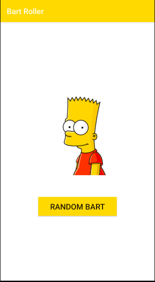

# Bart Roller
A variation of the Dice Roller app from the [Udacity Developing Android App with Kotlin](https://www.udacity.com/course/developing-android-apps-with-kotlin--ud9012) course using different assets and built from scratch.

## Project Goals
- Introduction to Android Studio
- Linear Layout
- Namespaces
- Gradle
- Building a basic single view app 

### Sources
Bart Simpson Images from [stickpng.com](https://www.stickpng.com/)
